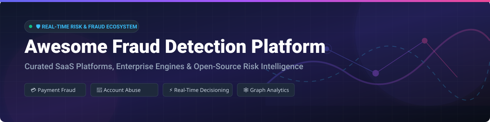

<p align="center">
  
</p>

# 🛡️ Awesome Fraud Detection Platform 🚀

[](https://github.com/ishandutta2007/Awesome-Awesome-Awesome)<a href="https://github.com/ishandutta2007/Awesome-Awesome-Awesome"></a><a href="https://discord.gg/jc4xtF58Ve"></a> [](https://opensource.org/licenses/MIT) [](http://makeapullrequest.com) <a href="https://github.com/ishandutta2007"></a>

A curated directory of **Fraud Detection SaaS Platforms**, **AI Transaction Monitoring Engines**, and **Open-Source Risk Intelligence Tools**.

---

## 📌 Table of Contents
- [🌐 Market Overview & Sector Dynamics](#-market-overview--sector-dynamics)
- [🏢 SaaS & Commercial Fraud Platforms](#-saas--commercial-fraud-platforms)
- [🔓 Open-Source GitHub Projects](#-open-source-github-projects)
- [🤝 How to Contribute](#-how-to-contribute)
- [💖 Support & Sponsorship](#-support--sponsorship)
- [📈 Star History](#-star-history)
- [⚠️ Disclaimer](#%EF%B8%8F-disclaimer)

---

## 🌐 Market Overview & Sector Dynamics

> 💡 **Market Size & Structure**: The global fraud detection and prevention (FDP) market size was valued at **~$28.5 Billion in 2024** and is projected to expand to **~$66.2 Billion by 2030** (CAGR of ~15.1%). 
> 
> The sector is **moderately fragmented**, featuring a split between enterprise incumbent credit/financial bureaus (e.g., Feedzai, Equifax/Kount), specialized identity network decisioning leaders (e.g., Forter, Riskified, Sift), and agile API-first fintech security startups (e.g., SEON, Sardine). While network effects create strong moat tendencies for merchant order verification, no single provider controls the market, encouraging continuous innovation in Graph AI and real-time behavioral biometric scoring.

---

## 🏢 SaaS & Commercial Fraud Platforms

Below is a curated comparison of leading SaaS & enterprise fraud decisioning platforms, ranked by market scale (company revenue / enterprise valuation).

| 🏢 Platform | 📊 Market Scale (Est. Valuation / Revenue) | 💰 Public Starting Price | 🎁 Free Tier / Free Trial Limits | ⚡ Key Capabilities & Focus |
| :--- | :--- | :--- | :--- | :--- |
| **[Feedzai](https://www.feedzai.com/)** | **~$1.0B+ Valuation** ($100M+ ARR) | Custom Enterprise Quote (Annual Contracts) | No free tier; sandbox demo upon request | Enterprise AI platform for bank-grade transaction monitoring & AML prevention. |
| **[Forter](https://www.forter.com/)** | **~$3.0B Valuation** ($200M+ ARR) | Custom Enterprise Quote (Per-transaction volume) | No free tier; custom retail pilot evaluation available | Autonomous real-time identity decisioning network with chargeback coverage options. |
| **[Riskified](https://www.riskified.com/)** | **~$1.0B Market Cap** ($290M+ Revenue) | Custom Enterprise Quote (% of approved sales) | No free tier; custom merchant historical data audit | Chargeback guarantee AI engine for e-commerce merchants transferring fraud liability. |
| **[Sift](https://sift.com/)** | **~$1.0B Valuation** ($100M+ ARR) | Custom Enterprise Quote (Starting ~$500/mo volume tier) | No forever free plan; 14-day sales demo evaluation | Machine learning risk scoring, workflows, and account abuse defense. |
| **[Signifyd](https://www.signifyd.com/)** | **~$1.34B Valuation** ($100M+ ARR) | Custom Enterprise Quote (Starting ~$1,500/mo min) | No free tier; 14-day sandbox access for enterprise trials | Commerce protection platform providing automated decisioning and financial guarantees. |
| **[Kount (Equifax)](https://kount.com/)** | **~$640M Acquisition** ($60M+ Revenue) | Custom Enterprise Quote (Starting ~$1,000/mo min) | No free tier; live demo upon enterprise request | Digital identity trust network with velocity scoring and chargeback management. |
| **[Sardine](https://www.sardine.ai/)** | **~$500M+ Valuation** ($20M+ ARR) | Custom Enterprise Quote (Starting ~$1,000/mo min) | No forever free plan; 14-day sandbox evaluation | Combined fraud detection, device intelligence, and instant ACH settlement risk scoring. |
| **[SEON](https://seon.io/)** | **~$500M Valuation** ($25M+ ARR) | **$599 / month** (Starter Plan) | **Forever Free Plan**: 2,000 API checks/mo, 2 seats, 10 custom rules + 14-day full trial | Social/email/phone footprinting & behavioral signals for fintechs and iGaming. |
| **[Fraud.net](https://www.fraud.net/)** | **~$50M - $100M Valuation** ($15M+ ARR) | Custom Enterprise Quote (Starting ~$499/mo) | No free tier; 30-day free trial on select API endpoints | Cloud-native collective intelligence platform for banking & financial workflows. |
| **[Ravelin](https://www.ravelin.com/)** | **~$50M - $100M Valuation** ($15M+ ARR) | Custom Enterprise Quote (Annual contracts) | No free tier; proof-of-concept audit with merchant data | Machine-learning fraud detection specialized in payment & account takeover protection. |

---

## 🔓 Open-Source GitHub Projects

Explore top open-source projects for building custom fraud detection pipelines, graph-based anomaly detectors, and transaction monitoring microservices. Sorted by GitHub community stars ⭐.

- **[yzhao062 / pyod](https://github.com/yzhao062/pyod)** [](https://github.com/yzhao062/pyod/stargazers)  
  Comprehensive Python toolkit for detecting outlying objects in transaction and anomaly datasets. Contains 40+ detection algorithms.

- **[t4d / StalkPhish](https://github.com/t4d/StalkPhish)** [](https://github.com/t4d/StalkPhish/stargazers)  
  Open-source threat intelligence and phishing kit investigation engine for proactive fraud prevention.

- **[IBM / TabFormer](https://github.com/IBM/TabFormer)** [](https://github.com/IBM/TabFormer/stargazers)  
  Tabular Transformers for modeling multivariate time-series transaction data in financial fraud applications.

- **[SantanderAI / gen-fraud-graph](https://github.com/SantanderAI/gen-fraud-graph)** [](https://github.com/SantanderAI/gen-fraud-graph/stargazers)  
  Synthetic graph generation framework for benchmarking graph neural network (GNN) fraud models in banking.

- **[awslabs / realtime-fraud-detection-with-gnn-on-dgl](https://github.com/awslabs/realtime-fraud-detection-with-gnn-on-dgl)** [](https://github.com/awslabs/realtime-fraud-detection-with-gnn-on-dgl/stargazers)  
  AWS reference architecture for building real-time fraud detection pipelines using Deep Graph Library (DGL) and Graph Neural Networks.

- **[GitiHubi / deepAI](https://github.com/GitiHubi/deepAI)** [](https://github.com/GitiHubi/deepAI/stargazers)  
  Deep autoencoder neural networks for detecting accounting anomalies and financial fraud patterns.

- **[safe-graph / DGFraud-TF2](https://github.com/safe-graph/DGFraud-TF2)** [](https://github.com/safe-graph/DGFraud-TF2/stargazers)  
  TensorFlow 2.X implementation of graph neural network models for financial and transaction fraud detection.

- **[jube-home / aml-fraud-transaction-monitoring](https://github.com/jube-home/aml-fraud-transaction-monitoring)** [](https://github.com/jube-home/aml-fraud-transaction-monitoring/stargazers)  
  Open-source (AGPLv3) engine combining business rule evaluation and ML scoring with case management for real-time transaction monitoring.

---

## 🛠️ Open-Source Stack Architectural Patterns

```
┌─────────────────────────┐    ┌─────────────────────────┐    ┌─────────────────────────┐
│  📥 Event Streaming    │ ──►│ 🧠 Feature Store & ML   │ ──►│ 🚨 Real-Time Scoring    │
│  (Kafka / Flink)        │    │ (Feast / PyOD / XGBoost)│    │ (FastAPI / ONNX)        │
└─────────────────────────┘    └─────────────────────────┘    └─────────────────────────┘
                                           │
                                           ▼
                               ┌─────────────────────────┐
                               │ 🕸️ Graph Analysis        │
                               │ (Neo4j / DGFraud-TF2)   │
                               └─────────────────────────┘
```

---

## 🤝 How to Contribute

Contributions are warmly welcomed! Help keep this curated list up-to-date and accurate:

1. 🍴 **Fork** the repository.
2. 📝 **Add or edit** entries in `README.md` following the standard table/list formats.
3. 🔗 Include official documentation links, explicit pricing details, and Stars_Counts where applicable.
4. 🚀 Open a **Pull Request** with a brief summary of additions!

---

## 💖 Support & Sponsorship

If you found this resource helpful for your risk team, fintech project, or security research, please consider supporting the project:

- ⭐ **Star** this repository to increase visibility!
- 🔀 **Fork** and share with colleagues in risk & fintech teams.
- ☕ **Buy Me a Coffee**: Support ongoing open-source maintenance via the [Sponsor Dashboard](https://github.com/sponsors/ishandutta2007).

---

## 📈 Star History

[](https://star-history.dera.page/#ishandutta2007/Awesome-Fraud-Detection-Platform&type=date&legend=top-left)

---

## ⚠️ Disclaimer

- This directory is a **community-curated project** for informational and educational purposes.
- Product pricing, enterprise valuations, and features change frequently. Always consult official vendor documentation for up-to-date quotes.
- Implementing open-source fraud models requires rigorous offline backtesting, real-time latency optimization, and compliance with regional financial regulations.
